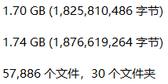

# 任务目标

对音频进行分类，训练集一共5万条音频，每个音频约1秒，sr约16000，一共30类。

# 文件概括

- \_\_init\_\_\.py：导入所需的库。
- arg\.py：命令行参数。
- callback\.py：进度条、日志等辅助工具。
- dataset\.py：数据集文件。
- model\.py：定义模型和训练逻辑。
- preprocess\.py：预处理和数据划分。
- transform\.py：数据增强文件。
- util\.py：指标和损失函数。
- train\.py：训练文件。
- inference\.py：推理文件。

# 环境要求

- 硬件：2080Ti*5
- 框架：Pytorch1.6，Pytorch Lightning
- 库：见requirements.txt
- 数据：修改train\.py和inference中的input_path为训练集路径

# 文件运行

- 训练：
  - python train.py -t 224 -m "dla60_res2next" -f 0 -g 0
  - python train.py -t 224 -m "dla60_res2next" -f 1 -g 1
  - python train.py -t 224 -m "dla60_res2next" -f 2 -g 2
  - python train.py -t 224 -m "dla60_res2next" -f 3 -g 3
  - python train.py -t 224 -m "dla60_res2next" -f 4 -g 4
- 推理：
  - python inference.py -t 224 -m "dla60_res2next" -f 5 -a "y"

# 总体思路

- 将数据进行五折划分，使用第一折进行试验。
- 使用librosa.feature.melspectrogram提取频谱图，从小分辨率开始实验（高32维持不变），注意归一化。
- 数据增强主要是高斯噪声、音频偏移和音量调节。
- 从resnet18开始，依次替换为更大更复杂的模型。
- 找到最终模型后进行五折集成。
- 进行不同种类模型的集成。
- 进行测试时增强集成。

# 实验过程

- 0.95259692758
  - 模型：resnet50
  - n_mels：64
- 0.95610826628
  - 模型：resnet50d
  - n_mels：64
- 0.95918068764
  - 模型：res2next50
  - n_mels：64
- 0.96576444770
  - 模型：res2next50
  - n_mels：64
  - width：64
- 0.96971470373
  - 模型：res2next50
  - n_mels：128
  - width：128
  - more augment
- 0.96898317484
  - 模型：resnest50d
  - n_mels：128
  - width：128
  - more augment
- 0.97307973665
  - 模型：res2next50
  - n_mels：224
  - width：224
  - more augment
- 0.97527432334
  - 模型：res2next50
  - n_mels：224
  - width：224
  - more augment
  - 5-fold hard ensemble
- 0.97542062911
  - 模型：res2next50
  - n_mels：224
  - width：224
  - more augment
  - 5-fold soft ensemble
- 0.97585954645
  - 模型：res2next50
  - n_mels：224
  - width：224
  - more augment
  - 5-fold soft ensemble
  - 4TTA
- 0.97527432334
  - 模型：res2next50
  - n_mels：224
  - width：224
  - more augment
  - 5-fold soft ensemble
  - 4TTA
  - smooth0.1
  - ohem0.9

# 反思总结

- 更大的分辨率可以达到更好的效果，但对机器要求也会随之提高。
- efficientnet系列训练快，效果好，但容易过拟合。
- 五折和TTA永远的神。
- 数据增强时不要使用音调调整，太慢了。
- 标签平滑为什么没用呢，俺也没有明白。
- OHEM可以更好地分类tree/three这种难例，但对整体的精度有所损失，可能需要训练更多epoch。